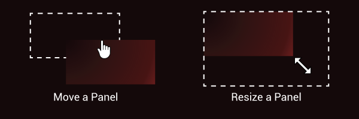
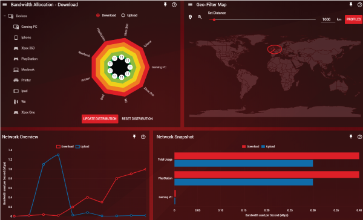

There are many unique features in DumaOS designed to help you to understand your network in an intuitive way. In this guide we will cover the Dashboard and the Network Monitor.

## Dashboard

The customizable DumaOS Dashboard acts as a one-stop-shop, where you can ‘pin’ your favourite features to a single screen and arrange them however you wish. This allows you to get the most out of your favourite features on one screen whilst gaming on another.

By default, several panels will be pinned to the Dashboard. If you wish to remove a panel from your Dashboard, click the 'pin' icon in the top right of any panel. Likewise to add a panel to your Dashboard you should also click the 'pin' icon. The 'pin' icon will change depending on whether a panel is included on your Dashboard or not:

After pinning whichever features you would like to use on your Dashboard, now it's time to rearrange them. To move a panel, click on the top of the panel and drag it. To resize a panel, click on the bottom right corner and drag to scale.

Using these tools you can easily create your own unique DumaOS Dashboard and build a space you love to use. Get creative!

## Network Monitor

With the Network Monitor, you can see the data usage of every device in your home, allowing you to understand the cause of congestion on your network.

Using Deep Packet Inspection worthy of enterprise routing, you can then see which applications are using bandwidth via in-depth breakdowns. This helps you to identify which applications are draining your Internet, such as viruses or programmes running in the background without your knowledge.

The Network Snapshot shows you a comparison of all of your connected devices and their bandwidth usage. The Network Overview shows your total bandwidth usage over the last 10 seconds.

To look at the data usage of a device in more depth, first click on the corresponding bar on the Network Snapshot graph.

This will open the Category Breakdown panel, giving you insight into what kind of data is being downloaded or uploaded on the selected device.

To go even further into detail, you can click on a segment of the Category Breakdown chart to open the Application Breakdown below. The Application Breakdown panel displays the data usage of specific applications running on the device. In this example, clicking on Social Media gave the results of Twitter and Facebook.

That concludes the DumaOS Optimal Settings Guide. If you wish to learn more, try checking out [this guide on how to get an open NAT type](/docs/dumaos-3/open-nat/), or [this guide to discover how to maximise your speeds using DumaOS](/docs/dumaos-3/maximum-bandwidth-speeds/).
