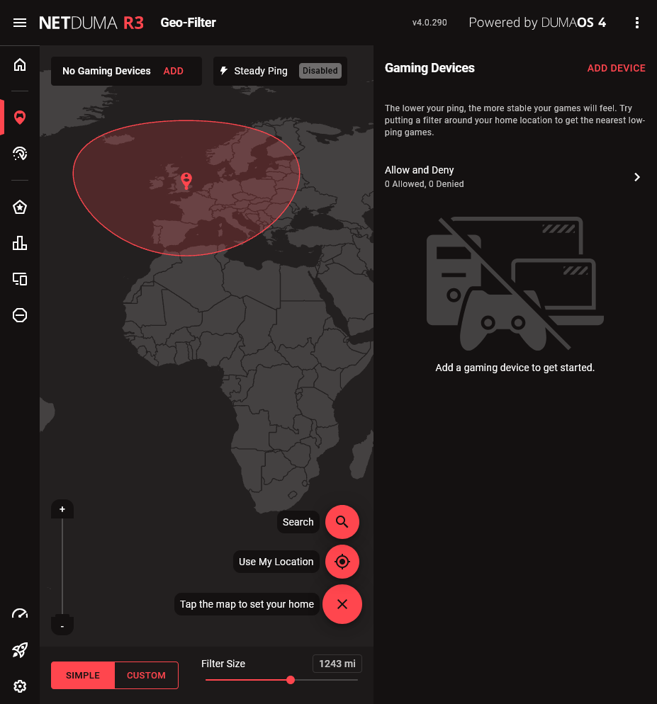
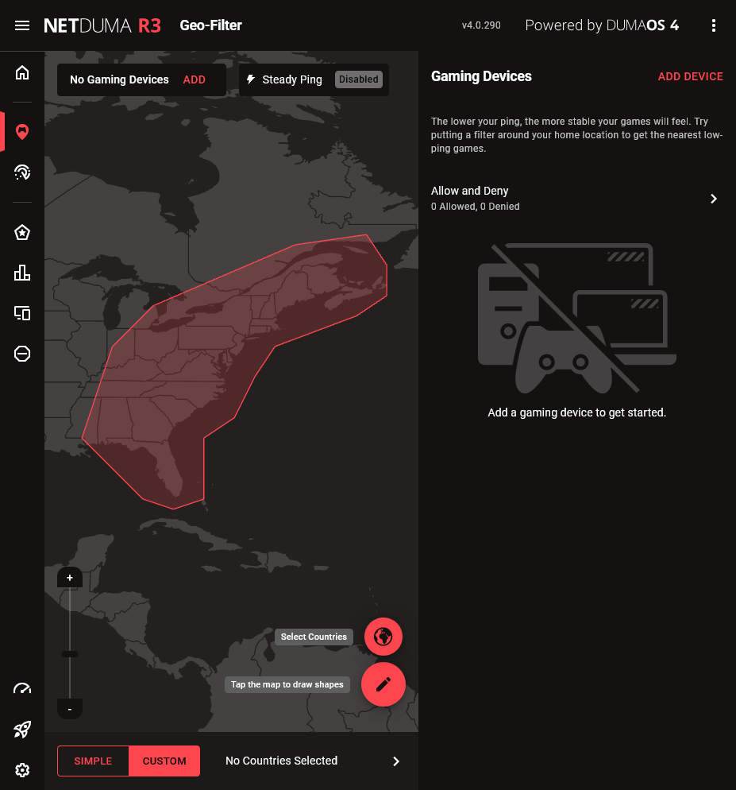
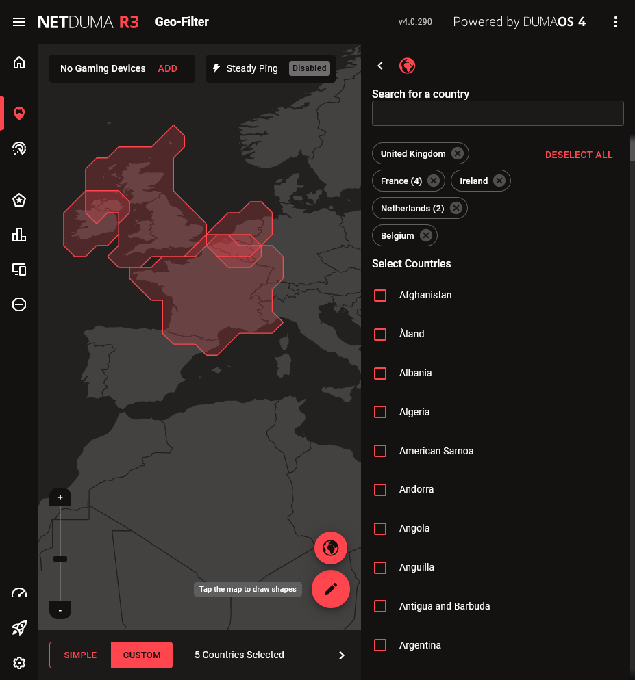

## Introduction

The Geo-Filter guarantees that the game servers you play on are always close home, giving you the best possible connection. The lower the ping, the better your game will feel overall.

Press Add Device to get started. If you add a PC, you’ll need to choose a game as well to ensure that any other activity on the device doesn’t get filtered.

## Using the filter

Adjust the Filter Size slider to choose how close to home you’d like your game hosts to be. You can change your filter location by pressing on the Home button on the map. Here you can search for your city / town, allow the router to use your location, or just press on the map.

You can also switch to Custom Mode, giving you the power to draw filter shapes wherever you want them. Try using the Pencil button to draw around servers or countries you prefer to connect to.

In Custom mode, you can also select specific countries to filter to, and shapes will automatically be drawn around them.

Try using Ping Heatmap to find the best server locations for a variety of games.

## Understanding your game

When in-game, tap on a connection on the map to view your connection quality and see how stable the server is. The better the server, the more responsive and smooth your gameplay will feel. You can also check your added device to see which game server is currently hosting your game.

You can choose to manually allow or deny any server you select. These can be viewed under ‘Allow & Deny’.

Your Ping is a measure of how long it will take for a button-press to happen in-game. You should aim for a lower ping, so that every pull of the trigger responds just as fast on the screen.

Even more importantly, you should try to secure a stable server. Stability is a measure of Jitter and Spikes (in milliseconds) - fluctuations in ping that can make your gameplay behave in unexpected ways. That’s why we developed Steady Ping, available in DumaOS 4.

## Steady Ping

Steady Ping smoothes out your gaming connection using the same approach as suspension in a car. By adding a small buffer to balance out any variation, the bumps and stutters you would usually feel in the game will be completely eliminated.

> Steady Ping is disabled by default, and must be switched on prior to the start of the game to take effect.

When you connect to a game, Steady Ping will take a few seconds to stabilise your connection. Once you’re stabilised, check out your ping to the host: on the chart, you can see how unstable your ping would’ve been on the bottom, and what your current ping is above.

In the rare case that Steady Ping can’t stabilise the host, your gameplay will be unaffected and proceed as normal. Since your average ping will only be increased by ~8ms to achieve rock-solid gameplay, there really is no down-side.
