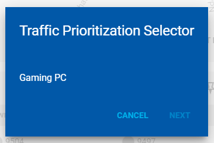
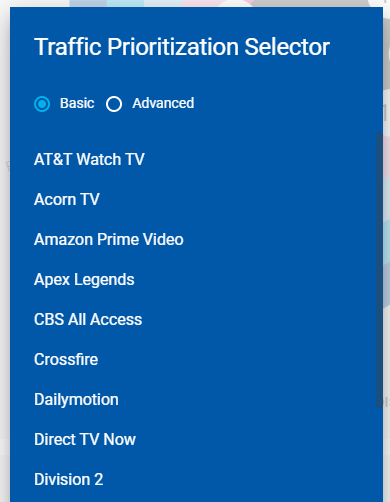
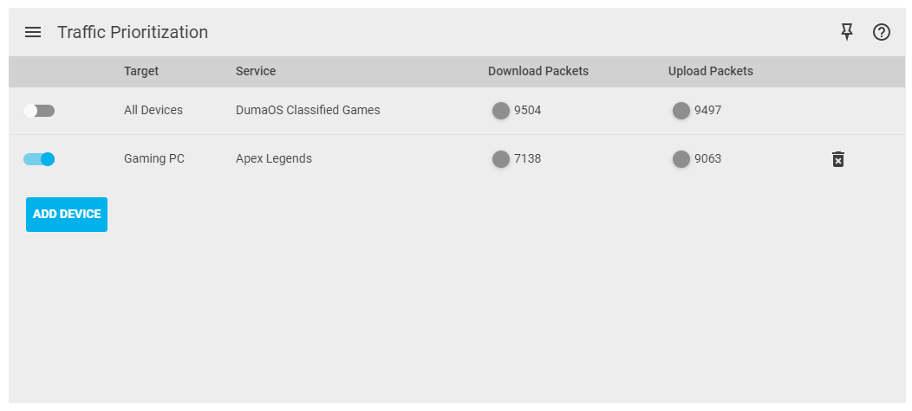
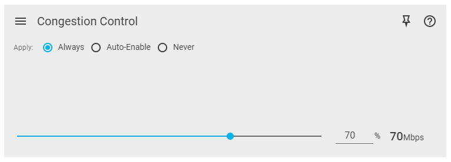

When devices in your home are using all the bandwidth, it creates congestion. This causes lag, especially for online games.

QoS gives you the complete toolset to solve this problem.

## Getting Started

### Traffic Prioritisation

Network congestion creates a queue, which forces games and other time-sensitive applications to wait.

Traffic Prioritisation guarantees that these time-sensitive applications will always be placed at the front of the queue, reducing lag.

#### Set up Traffic Prioritisation*

By default, all console games and most PC games are detected and prioritised. The circles indicate when this is taking effect. You can monitor how much data is being prioritised in Traffic Overview.

A) To add a service that has not automatically been detected, click Add Device.
B) Select a device from the Device Selector.
C) Select a Service or Ports to prioritise.

Once Traffic Prioritization is set up, we can move on to setting up
Congestion Control. We must set up both of these features for QoS to be
effective.

### Congestion Control

QoS will automatically detect your speeds when you first start it up. If your speeds are higher than 150mbps, some QoS features can be disabled to achieve higher speeds. To do this, simply turn off Full QoS.

To configure Congestion Control for gaming, follow the instructions below:

Select ‘Auto-Enable’ above the slider. This option automatically enables Congestion Control only when you are playing an online game. If you have a very busy home network such as a smart home, we recommend selecting 'Always' instead.

Set your Download slider to 70%. This is an ideal starting point, but if you experience a lot of lag, you should lower it by 10% at a time until the lag stops. After it stops, you can increase the slider by 5%, then 2%, and so on. By moving the slider and testing for lag, you can find the ideal “sweet spot” where bandwidth is maximized and lag is minimized.

From now on, when games are detected on your network, the gaming traffic will be moved to the front of the queue, eliminating lag even in tough network conditions.

### Bandwidth Allocation

Some devices need more bandwidth than others, such as a PC watching Netflix. With Bandwidth Allocation, you can control how your bandwidth is shared across all of your applications or devices.

#### Set your Allocation

1. In the Bandwidth Allocation submenu, you can choose either Devices or Applications to allocate bandwidth to.

2. Drag the percentage node next to a device to give it access to more or less bandwidth

3. Click Update Distribution to save your changes to Bandwidth Allocation.

4. Use the Download / Upload radio button to set your bandwidth allocation for Upload. Click Reset Distribution if you want to reset your Bandwidth Allocation to default.
